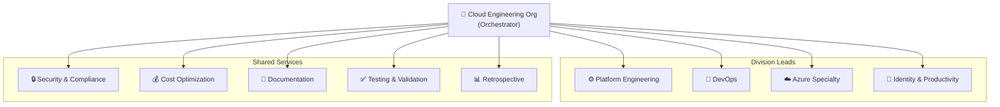
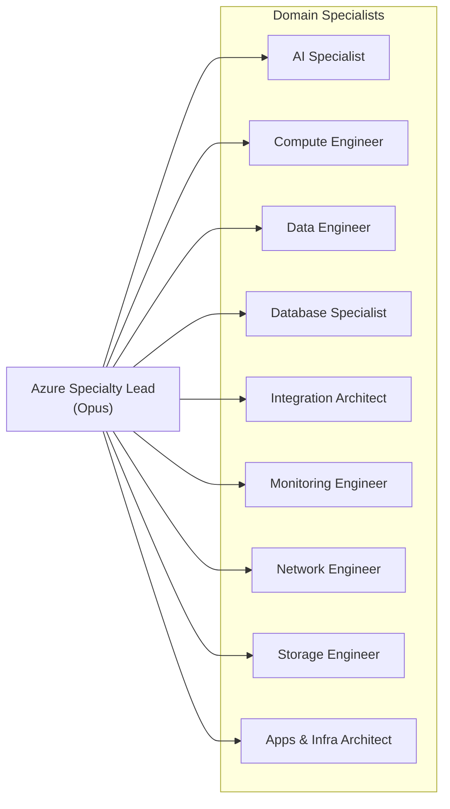
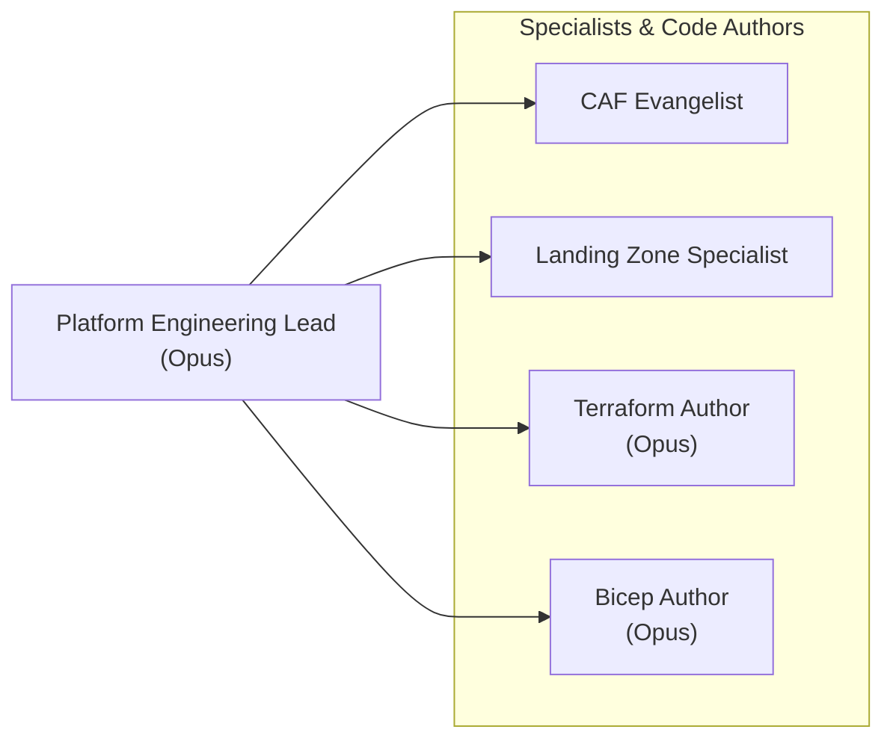
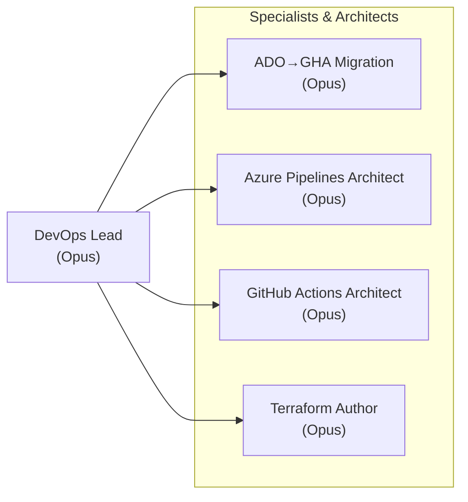
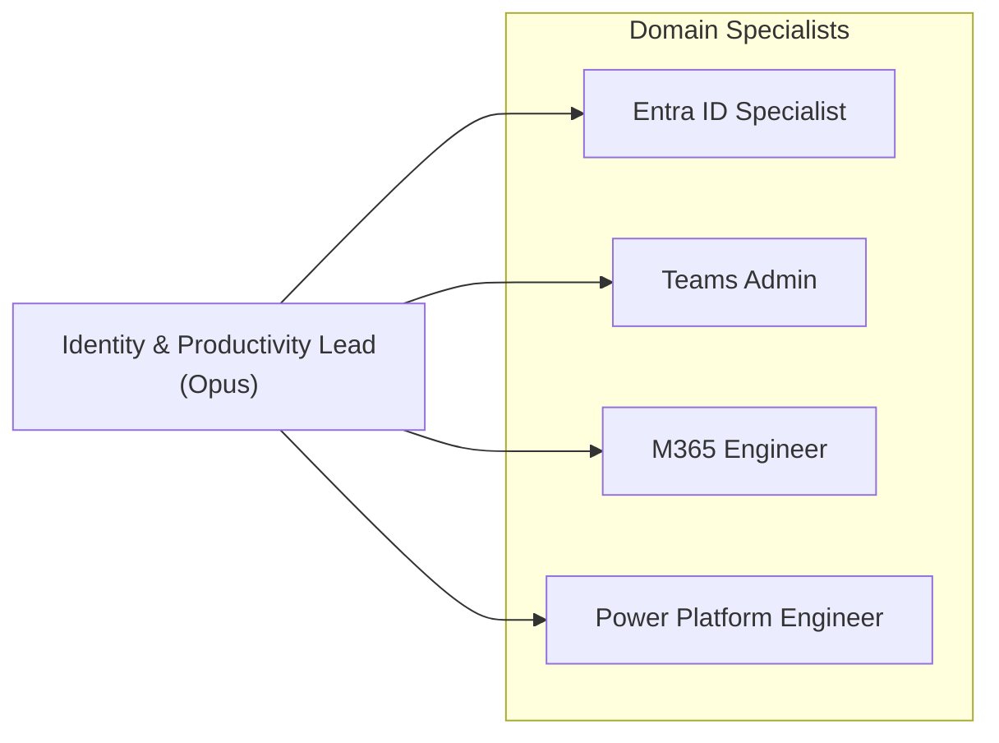

# GitHub Copilot Custom Agents

A collection of 31 custom VS Code Copilot agents organized as a virtual Microsoft Cloud Engineering organization. Each agent is a domain specialist with curated knowledge, specific tool access, and defined relationships to other agents — enabling multi-agent collaboration on complex Azure, M365, and DevOps problems.

## How It Works

Each `.agent.md` file in this repo is a VS Code custom agent. When placed in a workspace (or `~/.copilot/agents/`), VS Code discovers them and makes them available as `@agent-name` in Copilot Chat. Agents can call other agents as sub-agents, creating a delegation chain where an orchestrator decomposes a problem and routes pieces to specialists.

**Key design decisions:**
- Agents use **chunked knowledge files** instead of monolithic references — each agent reads a table of contents first, then loads only the chunks relevant to the current question
- **Model tiering**: Opus 4.6 for leads, code authors, and migration work; Sonnet 4.6 for domain SMEs (cheaper, sufficient for expert Q&A)
- **Each agent runs its own configured model** — when Agent A (Opus) delegates to Agent B (Sonnet), Agent B uses Sonnet, not the caller's model
- **MCP server integration**: MS Learn documentation search, Azure service APIs, GitHub, and GitKraken for git operations

## Architecture

### Organizational Structure



### Division Details

#### Azure Specialty Division



#### Platform Engineering Division



#### DevOps Division



#### Identity & Productivity Division



## Agent Inventory

### Division Leads (Opus 4.6)

Leads orchestrate work across multiple specialists. They decompose complex requests, sequence dependencies, and synthesize results.

| Agent | Display Name | Sub-Agents | Knowledge Chunks |
|-------|-------------|------------|-----------------|
| `cloud-engineering-org` | Microsoft Cloud Engineering Organization | 11 agents (discovery + 4 leads + 6 shared services) | 9 |
| `azure-specialty-lead` | Azure Specialty Lead | 10 agents (9 Azure specialists + cost + security) | 10 |
| `devops-lead` | DevOps Lead | 8 agents (3 CI/CD + terraform + cost/security/testing/retro) | 11 |
| `platform-engineering-lead` | Platform Engineering Lead | 9 agents (architect + LZ + CAF + IaC + shared services) | 12 |
| `identity-productivity-lead` | Identity & Productivity Lead | 5 agents (Entra + Teams + M365 + cost + security) | 10 |

> Note: `cloud-engineering-org` runs on **Sonnet 4.6** — it's an orchestrator, not a domain expert. The sub-agents it calls use their own configured models.

### Discovery & Assessment (Opus 4.6)

Specialists who execute commands to gather current state and produce baselines. Called early in engagements and by other specialists.

| Agent | Display Name | Purpose | Knowledge Chunks |
|-------|-------------|---------|-----------------|
| `azure-infrastructure-discovery` | Azure Infrastructure Discovery | Inventories current Azure infrastructure, licensing, configs, and compliance posture; produces current-state baseline | 7 |

### Code Authors (Opus 4.6)

These agents write, modify, and test code. They have `edit` and `execute` tool access.

| Agent | Display Name | Writes | Knowledge Chunks |
|-------|-------------|--------|-----------------|
| `azure-terraform-author` | Azure Terraform Author | Terraform HCL for Azure (azurerm, azapi) | 12 |
| `bicep-code-author` | Bicep Code Author | Bicep templates, modules, parameter files | 13 |
| `powershell-automation-dev` | PowerShell Automation Developer | PowerShell 7 scripts, Az modules, Graph SDK | 14 |
| `azure-pipelines-architect` | Azure Pipelines Architect | Azure DevOps YAML pipelines | 13 |
| `github-actions-architect` | GitHub Actions Architect | GitHub Actions workflows | 13 |
| `testing-validation-engineer` | Testing & Validation Engineer | Pester, Terraform tests, Bicep validation, load tests | 12 |

### Migration Specialist (Opus 4.6)

| Agent | Display Name | Purpose | Knowledge Chunks |
|-------|-------------|---------|-----------------|
| `ado-github-migration` | Azure Pipelines → GitHub Actions Migration Specialist | Maps ADO pipelines to GitHub Actions, orchestrates the two CI/CD architects | 12 |

### Domain SMEs (Sonnet 4.6)

These agents are researchers and advisors. They consult their knowledge base and MS Learn to answer domain questions.

| Agent | Display Name | Azure MCP Services | Knowledge Chunks |
|-------|-------------|-------------------|-----------------|
| `azure-ai-specialist` | Azure AI Specialist | foundry, search, cosmos, applicationinsights, monitor, pricing, keyvault, documentation | 12 |
| `azure-apps-infra-architect` | Azure Apps & Infra Architect | appservice, containerapps, aks, functionapp, functions, compute, keyvault, wellarchitectedframework, pricing, monitor, documentation | 11 |
| `azure-compute-engineer` | Azure Compute Engineer | compute, appservice, containerapps, aks, functions, monitor, pricing, wellarchitectedframework | 13 |
| `azure-data-engineer` | Azure Data Engineer | appservice, storage, keyvault, monitor, pricing, wellarchitectedframework | 12 |
| `azure-database-specialist` | Azure Database Specialist | — | 15 |
| `azure-integration-architect` | Azure Integration Architect | — | 12 |
| `azure-monitoring-engineer` | Azure Monitoring & Observability Engineer | — | 13 |
| `azure-network-engineer` | Azure Network Engineer | — | 12 |
| `azure-storage-engineer` | Azure Storage Engineer | storage, keyvault, monitor, pricing, wellarchitectedframework, documentation | 13 |
| `caf-evangelist` | Cloud Adoption Framework Evangelist | wellarchitectedframework, pricing, policy, monitor | 10 |
| `cost-optimization-specialist` | Cost Optimization Specialist | — | 12 |
| `documentation-writer` | Documentation Writer | — | 10 |
| `entra-id-specialist` | Entra ID Specialist | — | 12 |
| `landing-zone-specialist` | Landing Zone Specialist | policy, monitor, pricing, wellarchitectedframework, documentation | 11 |
| `m365-engineer` | Microsoft 365 Engineer | — | 12 |
| `power-platform-engineer` | Power Platform Engineer | — | 12 |
| `retrospective-agent` | Retrospective Agent | — | 11 |
| `security-compliance-analyst` | Security & Compliance Analyst | — | 15 |
| `teams-admin` | Microsoft Teams Administrator | — | 12 |

## Knowledge Management

### Chunked Knowledge Architecture

Each agent's knowledge is split into focused topic files instead of one large monolithic file:

```
agent-memory/
  azure-database-specialist/
    _toc.md                    ← Table of contents (agent reads this first)
    data-store-selection.md    ← When choosing between database services
    azure-sql-database.md      ← SQL Database tiers, models, elastic pools
    cosmos-db.md               ← RU math, partition keys, consistency
    security.md                ← Encryption, auth, masking, audit
    performance.md             ← Indexing, query tuning, wait stats
    ...
```

**How it works:**
1. Agent receives a question
2. Reads `_toc.md` — a table mapping topics to files with "when to load" guidance
3. Loads only the 1-2 chunk files relevant to the question
4. Responds using focused context instead of burning tokens on irrelevant material

**Why this matters:** Monolithic knowledge files (5,000+ lines) consumed significant context window budget on every invocation, even when 80% of the content was irrelevant to the current question. Chunking reduces token usage per interaction while keeping the same total knowledge available.

### Knowledge Currency

Each `_toc.md` includes a `Last Updated` timestamp so the agent knows how current its knowledge is. When knowledge is stale or the agent encounters a question beyond its chunks, it falls back to MS Learn MCP search for current documentation.

**Total knowledge:** 372 chunk files across 31 reference directories.

## Tool Access

### MCP Servers

| MCP Server | Format in YAML | Used By | Purpose |
|------------|---------------|---------|---------|
| Microsoft Learn | `microsoftdocs/mcp/*` | 30 agents | Search and fetch official Microsoft documentation |
| Azure Services | `com.microsoft/azure/<service>` | 9 agents | Direct Azure service APIs (storage, compute, pricing, etc.) |
| GitHub | `github/mcp/*`, `github/*` | 3 agents | Repo search, action metadata, PR/issue operations |
| GitKraken/GitLens | `gitkraken/*` | 3 agents | Git operations — branch, diff, blame, log |

### Core Tools

| Tool | Purpose | Available To |
|------|---------|-------------|
| `read` | Read workspace files | All agents |
| `search` | Search workspace | All agents |
| `web` | Web search and fetch | All agents |
| `agent` | Delegate to sub-agents | All agents |
| `edit` | Create and modify files | Code authors, doc-writer |
| `execute` | Run terminal commands | Code authors |
| `todo` | Track multi-step tasks | Leads, orchestrators, CI/CD architects |

## Usage Examples

### Direct specialist query
```
@azure-database-specialist Should I use Cosmos DB or PostgreSQL Flexible Server
for a multi-tenant SaaS app with variable schema per tenant?
```
The agent reads its `_toc.md`, loads `data-store-selection.md` and `cosmos-db.md`, and provides a comparison with cost math.

### Lead orchestration
```
@azure-specialty-lead Design a solution for a real-time IoT telemetry
pipeline that needs to ingest 100K events/sec, store hot data for 30 days,
and archive for 7 years.
```
The lead identifies this spans compute, data, storage, and networking. It delegates to the relevant specialists, sequences their work (network first, then compute, then data), and synthesizes their responses.

### Full organization engagement (multi-agent coordination)
```
@cloud-engineering-org We're migrating a legacy .NET Framework monolith
to Azure. 50 developers, SOC2 compliance required, $200K/month budget ceiling.
Plan the engagement.
```
The org agent:
1. **Reads** the engagement-coordination-protocol skill (mandatory for all orchestrators)
2. **Creates** engagement folder with SCOPE.md
3. **Calls** each division lead with fresh context (file-based handoff, no history chains)
4. **Logs** each call to AGENT-CALLS.json (audit trail)
5. **Synthesizes** outputs into ARCHITECTURE-PLAN.md (the contract)
6. **Enforces** mandatory gates (security veto, cost approval, documentation)
7. **Produces** phased plan with milestones and dependencies
8. **Waits** for user delivery, then calls Retrospective Agent to analyze spec vs actual

Result: When user implements and delivers, org can analyze where/why implementation diverged from plan and extract lessons for next engagement.

### CI/CD migration
```
@ado-github-migration Analyze the Azure Pipelines in this repo and
create equivalent GitHub Actions workflows.
```
The migration specialist inventories ADO pipelines, delegates ADO analysis to `azure-pipelines-architect` and GHA design to `github-actions-architect`, maps concepts between platforms, and produces migrated workflow files.

## Model Tiers

| Tier | Model | Count | Rationale |
|------|-------|-------|-----------|
| **Opus 4.6** | `Claude Opus 4.6 (copilot)` | 11 | Code generation, complex orchestration, multi-step reasoning |
| **Sonnet 4.6** | `Claude Sonnet 4.6 (copilot)` | 20 | Domain expertise, knowledge retrieval, advisory responses |

Model is configured per-agent and is **not inherited** when one agent calls another. An Opus lead calling a Sonnet specialist does not upgrade the specialist to Opus — each agent uses its own model.

## Reusable Skills

Skills are cross-agent playbooks, checklists, and decision frameworks that multiple agents reference. Each skill is discoverable and self-contained.

**See [skills/README.md](./skills/README.md) for the complete skills directory, how to use them, and how to add new ones.**

### Key Skill: Engagement Coordination Protocol

The **engagement-coordination-protocol** skill defines how agents coordinate multi-agent engagements without context bloat:

```
engagement-[name]/
├── SCOPE.md                      # User request, constraints, success criteria
├── ARCHITECTURE-PLAN.md          # Final specification (contract with user)
├── AGENT-CALLS.json              # Audit log: who was called, what they returned
├── IMPLEMENTATION-TASKS.md       # What each team will build
├── outputs/                      # Assessment/review outputs from agents
├── code/                         # Implementation artifacts
├── final-delivery/               # User-provided implementation
└── RETROSPECTIVE.md              # Post-engagement analysis
```

This pattern enables:
- **Fresh context per agent** — No nested conversation history bloat
- **File-based handoffs** — Agents read files, write to specific paths, respond once
- **Audit trail for learning** — AGENT-CALLS.json tracks decisions and rationale
- **Retrospective analysis** — Compare planned vs actual, improve next engagement

**See**: `skills/engagement-coordination-protocol.skill/SKILL.md` for complete handoff templates and practices.

### Engagement Lifecycle with Retrospective

1. **Scope** (Org) — Create engagement folder, populate SCOPE.md
2. **Assess** (Division Leads) — Read SCOPE, write to outputs/, return path + summary
3. **Plan** (Org) — Synthesize assessments into ARCHITECTURE-PLAN.md
4. **Implement** (Code Authors) — Read ARCHITECTURE-PLAN, write to code/
5. **Review** (Shared Services) — Read spec, review deliverables, sign off
6. **Deliver** (User) — Implement solution, store in final-delivery/
7. **Retrospective** (Retrospective Agent) — Compare planned vs actual, capture lessons

The retrospective agent analyzes SCOPE, ARCHITECTURE-PLAN, AGENT-CALLS, and final-delivery to produce action items and organizational learning.

## File Structure

```
├── agents/                       # Agent definitions (31 files)
│   └── *.agent.md
├── agent-memory/               # Chunked knowledge bases
│   ├── <agent-name>/
│   │   ├── _toc.md               # Knowledge index with "when to load" guidance
│   │   └── *.md                  # Topic-specific knowledge chunks
│   └── ... (28 agent knowledge directories)
├── skills/                       # Cross-agent reusable playbooks & checklists (see skills/README.md)
│   ├── README.md                   # Skills directory, how to use, how to add
│   ├── engagement-coordination-protocol.skill/SKILL.md   # Multi-agent handoff protocol
│   ├── agent-voice-guide.skill/SKILL.md
│   ├── agent-consistency-audit.skill/SKILL.md
│   └── [20+ other skills]
├── prompts/                      # Original persona prompts that seeded agents
└── README.md
```

## Agent YAML Frontmatter Format

```yaml
---
name: Display Name Shown in VS Code
description: >-
  When to use this agent. Shown in agent picker and used for routing.
tools:
  - read
  - search
  - web
  - agent
  - microsoftdocs/mcp/*
  - com.microsoft/azure/storage     # Only if agent needs Azure service APIs
agents:
  - other-agent-filename            # References by filename stem, not display name
model: "Claude Sonnet 4.6 (copilot)"
argument-hint: Short prompt hint shown in chat input
---
```

## Mandatory Gates

Three gates apply to all work flowing through the organization:

| Gate | Owner | Authority |
|------|-------|-----------|
| **Security** | `security-compliance-analyst` | Veto power — can block any deployment |
| **Cost** | `cost-optimization-specialist` | Budget approval — reviews spend impact |
| **Documentation** | `documentation-writer` | Close gate — work isn't done until documented |

## Development Notes

- Agent references in the `agents:` field use the **filename stem** (e.g., `azure-network-engineer`), not the display name
- Knowledge chunks contain only verified content — no speculative additions. Expansion requires MS Learn or Context7 MCP verification first
- The three CI/CD agents (`ado-github-migration`, `azure-pipelines-architect`, `github-actions-architect`) were built separately with a richer tool palette including `vscode/askQuestions`, `read/problems`, `search/changes`, and `gitkraken/*`
- `Explore` in agent lists refers to the built-in VS Code Copilot exploration subagent, not a custom agent
